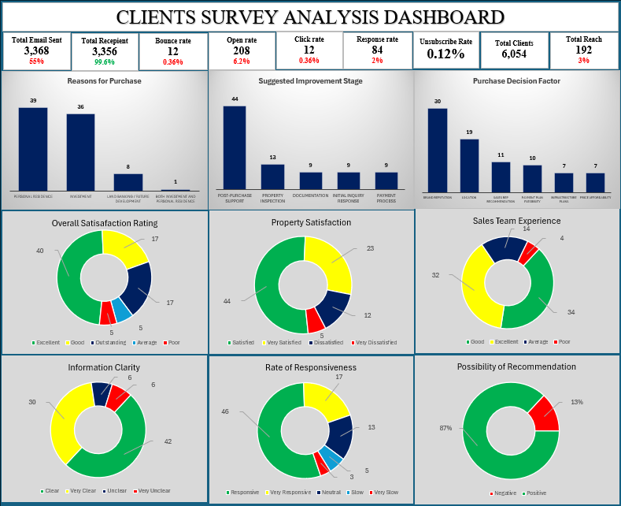

Client Sentiment & Satisfaction Analysis

**Tool:** Excel (pivot analysis + rule-based sentiment scoring)
**Scope:** A structured client experience survey, a large-scale likelihood-to-recommend pulse, and a text-mined sentiment log of individual client reviews

## Overview

This project answers a question every business eventually has to face directly: **clients say they're satisfied overall — so why do specific complaints keep recurring?** It combines two data sources to answer that from both angles — a structured multiple-choice survey capturing *how* clients feel across the buying journey, and a free-text review log capturing *what* they're actually saying in their own words, scored for sentiment and tagged by category.

The workbook has three connected sheets, each answering a different layer of that question:

The category mix has shifted too — in the executive summary, *Delivery & Timeline* was the largest category (15 reviews, 10 of them negative); in the full current log, *General Satisfaction* is now largest (27 reviews) and *Delivery & Timeline* has shrunk to 8.

This isn't a criticism of the analysis — it's exactly what happens when a source log keeps growing (84 → 103 reviews) but the summary dashboard built on top of it doesn't get refreshed. It's flagged here because **the Sentiment Dashboard currently overstates how positive client sentiment is** — anyone glancing at just that sheet would walk away with a materially rosier picture than the underlying data supports. Worth refreshing the pivot before this workbook informs any decision, or before it's published.

Everything below uses the **full, current 103-review dataset** from Review Analysis as the source of truth, alongside the Survey Dashboard's independent structured-survey findings.

---

## Part 1: Client Experience Survey (n = 84)

A structured, multiple-choice survey capturing satisfaction at each stage of the client journey.

**Purchase Reason** — Personal residence (39, 46%), Investment (36, 43%), Land banking/future development (8, 10%), Both (1, 1%).
*Insight:* Buyers split almost evenly between personal residence and investment purposes — product messaging and after-sales support should serve both personas equally rather than assuming one dominant buyer type.

**Top Factors in Purchase Decision** — Brand reputation (30, 36%), Location (19, 23%), Sales rep recommendation (11, 13%), Payment plan flexibility (10, 12%), Infrastructure plans (7, 8%), Price affordability (7, 8%).
*Insight:* Brand reputation outweighs even location as the top purchase driver — over a third of clients bought primarily because of the Brand name. That makes reputation the company's single most valuable (and most fragile) asset, directly at stake every time a delivery promise is missed.

**Overall Satisfaction** — Excellent (40, 48%), Good (17, 20%), Outstanding (17, 20%), Average (5, 6%), Poor (5, 6%).
*Insight:* 88% rate their overall experience Good or better — a genuinely strong headline number.

**Property Satisfaction** — Satisfied (44, 52%), Very Satisfied (23, 27%), Dissatisfied (12, 14%), Very Dissatisfied (5, 6%).
*Insight:* 80% satisfied-or-better with the property itself, but the ~20% dissatisfied segment (17 people) is worth a closer look since the property is the core product being sold.

**Sales Team Experience** — Good (34, 40%), Excellent (32, 38%), Average (14, 17%), Poor (4, 5%).
*Insight:* Combined Good+Excellent (78%) makes the sales team the strongest-performing touchpoint in the entire journey.

**Information Clarity** — Clear (42, 50%), Very Clear (30, 36%), Unclear (6, 7%), Very Unclear (6, 7%).
*Insight:* 86% found information clear — but the 14% who didn't lines up closely with the documentation and communication complaints found independently in the review text below.

**Responsiveness** — Responsive (46, 55%), Very Responsive (17, 20%), Neutral (13, 15%), Slow (5, 6%), Very Slow (3, 4%).
*Insight:* A combined 25% rate responsiveness as Neutral-or-worse — a full quarter of respondents, and a pattern that shows up again in the "Communication" complaints in the review log.

**Improvement Stage (client-nominated)** — Post-purchase support (44, 52%), Property inspection (13, 15%), Documentation (9, 11%), Initial inquiry response (9, 11%), Payment process (9, 11%).
*Insight: this is the single most important number in the whole survey.* More than half of all clients who flagged an area for improvement pointed to **post-purchase support** — more than the other four stages combined. This isn't a minor signal buried in the data; it's the clearest, most consistent finding across the entire project (see Part 3 for how it's independently corroborated by the review text).

---

## Part 2: Likelihood to Recommend — NPS Pulse (n = 603)

A separate, much larger pulse question (1–10 scale), asked independently of the 84-person structured survey.

**Distribution:** Score 10 alone accounts for 230 responses — 38% of everyone surveyed gave the maximum possible score.

**Net Promoter Score, calculated from the raw distribution:**
- Promoters (9–10): 329 respondents (54.6%)
- Passives (7–8): 165 respondents (27.4%)
- Detractors (1–6): 109 respondents (18.1%)
- **NPS = 54.6% − 18.1% = +36**

*Insight:* The sheet itself only shows a simplified above/below-5 split (86.9% "positive"), which somewhat overstates things — a proper NPS calculation using the standard Promoter/Passive/Detractor bands gives **+36**, which is a genuinely solid score (positive and comfortably "good" by industry benchmarks) but a more honest, standardized number to report to leadership or cite externally than the simplified split currently on the sheet.

---

## Part 3: Review-Level Sentiment Analysis (n = 103)

Each client review was individually scored on a **−1 to +1 sentiment scale** (in 0.1 increments), tagged with a **Category** (which part of the business it concerns), flagged **Actionable** (Yes/No), and given a visual **Intensity** bar reflecting the strength of the sentiment.

**Overall sentiment split:**
- Negative: 52 (50.5%)
- Neutral: 28 (27.2%)
- Positive: 14 (13.6%)
- Recommendation (suggestion-flagged): 9 (8.7%)
- Average score: **−0.18** (mild negative skew)

**Actionability:** 91 of 103 reviews (88.3%) were flagged actionable — an unusually high rate. Almost nothing in this log is "just noise"; the overwhelming majority of client feedback points to something the business can concretely act on.

**Category breakdown (n = 103):**

| Category | Count | % of total |
|---|---|---|
| General Satisfaction | 27 | 26.2% |
| Communication | 20 | 19.4% |
| Infrastructure | 18 | 17.5% |
| Pricing & Payment | 17 | 16.5% |
| Documentation | 8 | 7.8% |
| Delivery & Timeline | 8 | 7.8% |
| Customer Service | 2 | 1.9% |
| After-Sales Support | 2 | 1.9% |
| Site Inspection | 1 | 1.0% |

*Insight:* **Communication** and **Infrastructure** together account for over a third of all reviews, and both are recurring negative themes — clients describe delayed responses, promised infrastructure not materializing on schedule, and unclear updates during the build/delivery process. This directly echoes the survey's Responsiveness and Information Clarity findings from Part 1 — two independent data sources, quantitative and qualitative, converging on the same operational gap.

**Representative issues pulled from the log** (paraphrased, patterns rather than individual quotes):
- Requests for more proactive, personal communication instead of relying solely on email
- Delays in confirming payments or explaining charges (surcharges, infrastructure fees) clearly upfront
- Infrastructure and site development not keeping pace with what was promised at point of sale
- Requests for faster turnaround on documentation (survey drawings, floor plans) after purchase

---

## Key Takeaways

1. **Sentiment is more negative right now than the executive dashboard suggests** — refresh the Sentiment Dashboard pivot against the full 103-review log before this informs any decision (see callout above).
2. **Post-purchase support is the standout priority.** It's the #1 client-nominated improvement area in the structured survey (52%) and the underlying theme connecting the largest negative categories (Communication, Infrastructure) in the review log — two independent data sources agreeing on the same answer.
3. **Brand reputation is the brand biggest asset and its biggest exposure.** It's the #1 reason clients buy (36%) — which raises the stakes on closing the post-purchase gap, since reputation is what's actually being spent every time a delivery promise slips.
4. **The core relationship is still healthy at scale.** An NPS of +36 across 603 respondents is a genuinely strong foundation — this isn't a satisfaction crisis, it's a specific, well-defined, fixable gap in one part of the journey.

## Recommendations

- **Stand up a formal post-purchase communication cadence** (scheduled updates, not just reactive responses to inquiries) — the single highest-leverage fix indicated by this data.
- **Investigate the Infrastructure and Delivery & Timeline complaints specifically** — these carry the most severe language in the review log (missed multi-year delivery promises, unmet infrastructure commitments) and pose the greatest reputational risk given brand reputation's outsized role in purchase decisions.
- **Refresh the Sentiment Dashboard** to reflect the current 103-review dataset, and consider adding the properly-calculated NPS (+36) alongside the existing simplified positive/negative split.
- **Close the loop with detractors specifically** — with 109 detractors identified in the NPS pulse, even a modest recovery effort with this group would move the overall score meaningfully.

---

